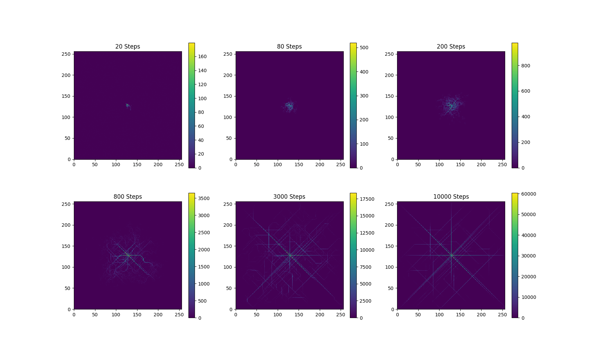

# scicomp-p1-mira-ants

## Overview

I decided to recreate a simple version of the model shown in “Modelling the Formation of Trail Networks by Foraging Ants” by James Watmough and Leah Edelstein-Kehet. I did this with a focus on documentation, readability, and commenting. My [project plan](project_plan.md) has more information on my goals.

## How to run

To run the code, either run `main.py`, or to run in your own code:

1. Import the simulation class
`from ant_simulation import Simulation`

2. Create a new simulation
`sim = Simulation()`
Optional parameters of Simulation:
- `shape` (default (256,256)): 2-element tuple that specifies the size of the simulation space
- `phermone_deposit_rate` (default 16): integer amount of phermones deposited by an ant per time step
- `phermone_evap_rate` (default 1): integer amount of phermones that evaporate per cell over time
- `fidelity_min`: float decimal between 0 and 1, the minimum chance of self.fidelity_test() returning true
- `fidelity_max`: float decimal between 0 and 1, the maximum chance of self.fidelity_test() returning true
- `phermone_max`: integer, the maximum quantity of phermones that the ant can sense
- `trail_level`: integer, the minimum phermone level that the ant will consider to be following a trail
- `turning_kernel`: the turning kernel to be used when exploring. Must be an odd length, and should be between 1 and 7 items long

3. Run the simulation for a specific number of steps (for example, 200)
`sim.loop(200)`

- To run the simulation and print the array at each step, set the `print_iter` parameter of `sim.loop` to `True`
- To run the simulation and wait at each step (helpful when using `print_iter`), set the `sleep` parameter of `sim.loop` to the number of seconds to sleep. I like 0.1.

4. Print the simulation's array to see the output (note: I haven't made a proper viewer for this data)
`print(sim.array)`

### Full code to run the simulation

```
from ant_simulation import Simulation
sim = Simulation()
sim.loop(100, print_iter=True, sleep=0.1)
print(sim.array)
```

## Project Structure Overview

- [main.py](main.py) is a file only to run the simulation. It currently displays 6 subplots, each with the default simulation running to different numbers of steps
- [ant_simulation.py](ant_simulation.py) contains the Simulation class, which is the class that controls each run of the simulation. This handles tracking & modifying phermone levels, tracking and stepping each ant, displaying, and stores the simulation's variable values
- [ant.py](ant.py) contains the Ant class, which is the class for each agent. Each ant tracks its location, applicable variable values, what simulation it belongs to, and handles movement logic.

## Sample Output

Default parameters, the output of main.py:

